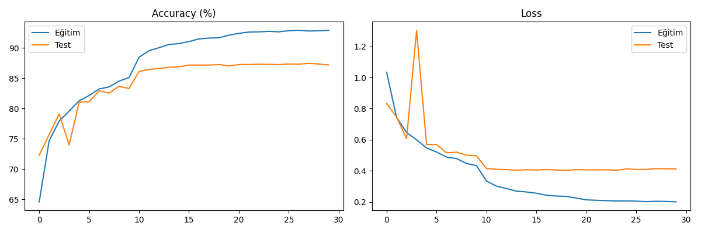
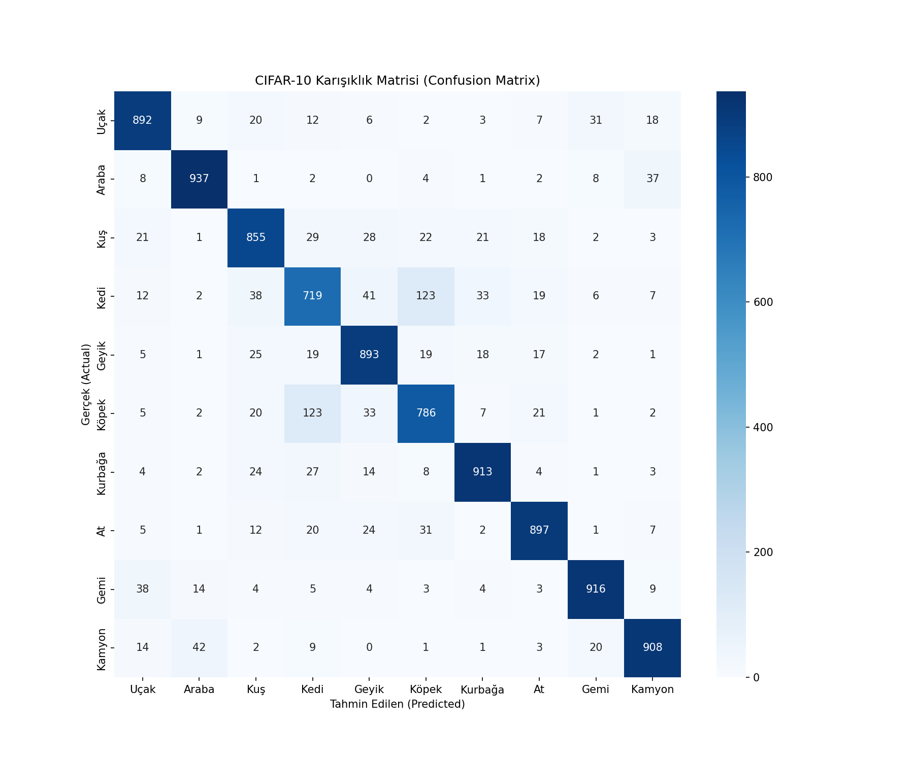

# Project 4: CIFAR-10 Object Classification with ResNet-18

Bu çalışma, CIFAR-10 veri seti kullanılarak 10 farklı nesne sınıfının (uçak, araba, kuş, kedi, geyik, köpek, kurbağa, at, gemi, kamyon) derin öğrenme ile sınıflandırılmasını içermektedir.

## Performans Analizi
Model, eğitim sonunda test setinde **%87.5** doğruluk oranına ulaşmıştır.

### Eğitim Süreci

* **Gözlem:** 10. epoch civarında uygulanan learning rate scheduler sayesinde model kararlı bir yakınsama göstermiştir.

### Karışıklık Matrisi (Confusion Matrix)

* **Analiz:** Model, araç sınıflarında (Araba, Gemi) mükemmel performans sergilerken, morfolojik benzerlik nedeniyle **Kedi** ve **Köpek** sınıflarını en çok birbiriyle karıştırmaktadır (123 hata).

##  Green AI 
Bu projede, yüksek enerji tüketen devasa modeller yerine, daha düşük parametre sayısına sahip olan **ResNet-18** mimarisi tercih edilmiştir. Bu sayede donanım kaynakları  verimli kullanılmış ve karbon ayak izi minimize edilmiştir.

##  Teknik Detaylar
- **Mimari:** ResNet-18 (Transfer Learning)
- **Epoch:** 30
- **Optimizer:** Adam
- **Normalizasyon:** (0.5, 0.5, 0.5) Mean/Std