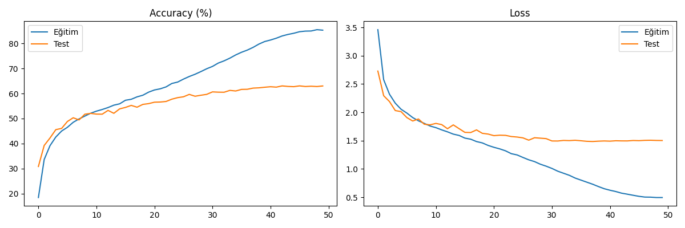

# Project 5: CIFAR-100 Fine-Grained Classification with ResNet-18

Bu çalışma, 100 farklı nesne sınıfına sahip olan ve sınıflandırma zorluğu yüksek CIFAR-100 veri seti üzerinde gerçekleştirilmiştir. Proje, modelin hiyerarşik sınıflar arasındaki ayrım gücünü ölçmeyi hedefler.

##  Performans ve Hata Analizi
Model, 50 epoch sonunda test setinde **%63.2** doğruluk oranına ulaşmıştır.

### Eğitim Süreci

* **Analiz:** Eğitim doğruluğu %85'e çıkarken test doğruluğunun %63'te kalması, 100 sınıfın getirdiği semantik benzerliklerin (Örn: akçaağaç vs. meşe) genelleme kapasitesini (generalization gap) zorladığını göstermektedir.

### Karışıklık Matrisi (Confusion Matrix)

* **Gözlem:** Matris üzerindeki yoğunlaşmalar, modelin nesneleri "super-class" (üst sınıf) düzeyinde (Örn: tüm meyveler veya tüm araçlar) doğru grupladığını ancak mikro detaylarda (fine-grained) zorlandığını kanıtlamaktadır.

##  Green AI 
CIFAR-100 gibi karmaşık bir problemde, karbon ayak izini düşük tutmak amacıyla **ResNet-18** gibi hafif bir mimari kullanılmıştır. %63.2'lik başarı, enerji verimliliği ve model doğruluğu arasındaki optimal dengeyi (efficiency vs. accuracy trade-off) temsil etmektedir.

##  Teknik Detaylar
- **Mimari:** ResNet-18 (50 Epoch)
- **Veri Seti:** CIFAR-100 (Sınıf başına 500 eğitim örneği)
- **Donanım:** NVIDIA RTX 3050
- **Önemli Bulgular:** 32x32 çözünürlükteki bilgi kaybı (information loss), modelin ince detayları yakalamasını kısıtlayan temel faktördür.